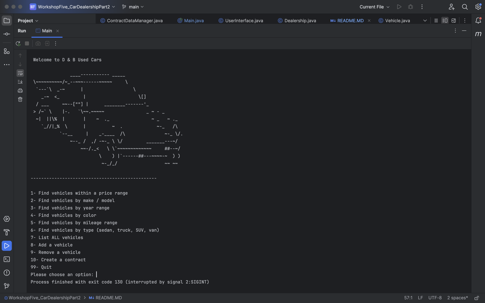
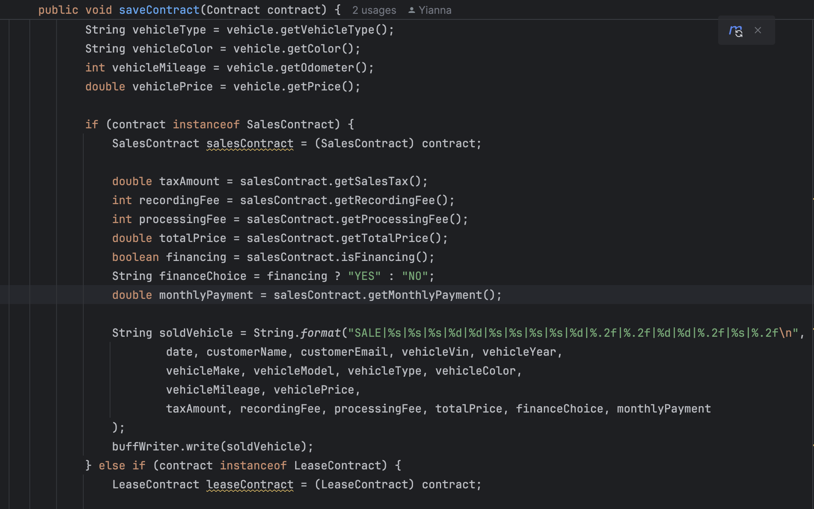
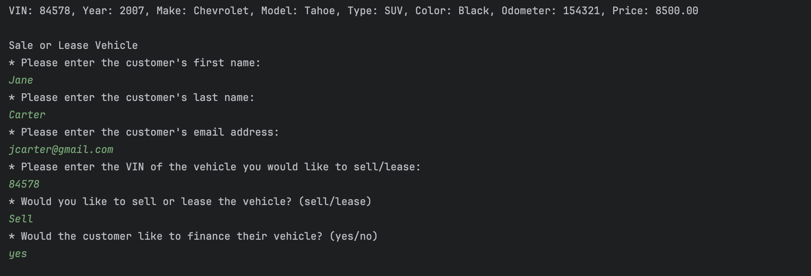
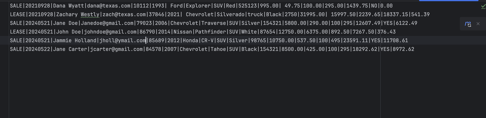

# WORKSHOP FIVE CAR DEALERSHIP PART 2

## Overview

This project is a Command-Line Interface (CLI) application for a car dealership. It allows users to view, add, and remove vehicles, as well as filter vehicles by various criteria such as price, make and model, year, color, mileage, and type. 
In this workshop I added more functionality that the user can now sell or lease a vehicle.

## Features

- View all vehicles
- Filter vehicles by:
  - Price range
  - Make and model
  - Year range
  - Color
  - Mileage range
  - Type (e.g., sedan, truck, SUV, van)
- Add new vehicles to the inventory
- Remove vehicles from the inventory
- Sell or Lease a Vehicle

## Understanding the Problem

### Inputs

- User input through CLI

### Outputs

- Command-Line Interface (CLI) display of vehicle information based on user queries

## Making a Plan

### Pseudocode


```// Pseudocode

// Using Scanner to take an initial user menu command

// First welcoming the user to D & B used car dealership,

// Second the user is prompted to the menu and to select from the options 

// Third the user is given an option to exit the program.

// After the prompt the user can select options 1-10 and 99 to quit the program depending on what they are looking for 

// The User can also Sell or lease a vehicle by the vin number and it removes the vehicle from the inventory

// The user would be asked for their first and last name and email address if they are financing or not and for the vehicle vin

// The application will print to the CLI the result of the user options
```


## Developers Favorite Piece Of Code
<details>
<summary>Click to expand  </summary>

I also enjoyed adding Ascii code to my project I thought the car piece of code would complement the project and make it more fun.



This if my favorite piece of code because it was a challenge for me due to trying to learn how to understand instanceof and I also had to understand how to pass the sales contract to contract in order to get all the information I needed. 



</details>


## SnapShots of the code working
<details>
<summary> Click to expand </summary>

### User input 


### Updated file manager


</details>


### Future Features
<details>
  <summary>Click to expand</summary>

- Checkout Menu
- Payment option
- Feedback
- User Authentication

</details>
